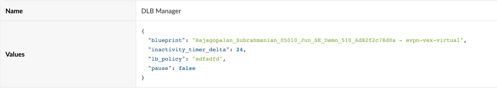

# DLB Tuner

The Dynamic Load Balancing (DLB) functionality provides for an improvement over static load balancing.
However, the inactivity timer needs to be tuned to the load. If this is too small, you will have packets being delivered out of sequence.

This automation provides a way to adjust the inactivity timer interval based on the occurrence of out of sequence packets.

This PowerPack can be run either as a python application or as a docker container. The steps are documented below.

## Requirements
- Apstra 6.0.0 or above
- python 3 or above

## Usage

1. Prepare the PowerPack
- Set up Environment variables 
    - Fill out apstra_dlb_setup.sh
    - % source apstra_dlb_setup.sh
- copy setup.yaml.template to setup.yaml. Fill in the values as appropriate
- Apstra needs to have a Property Set that is used to manage the power pack. 
- This can be auto-created with Terraform or manually in the UI
- Setting up Property Set in Apstra with Terraform
    - % terraform init&&terraform apply
    - This will set up a Property Set called Ticket Manager with all the blueprints in the environment.
    - Inspect the Property Set and ensure that only the blueprints you want to track are in the list   
 - Setting up  Property Set in Apstra manually
    - Set up the management Property Set in Apstra with appropriate values
    
    -  ignore_anomalies - List of Anomalies to Ignore
       ignore_devices - List of device hostnames to ignore
       include_only_anomalies - List of anomalies to include, all others will be ignored
       include_only_devices - List of devices to include, all others will be ignored
       include_only_severity -List of severities to include, all others will be ignored
    - Leaving all of these as empty lists will result in all anomalies on all devices being reported
   
2. Run PowerPack with Docker 
- Navigate to root directory
- % docker build -f ./DLBTuning/Dockerfile .
  - At the end of this commend, you will get the id of the image that just got built use it in the next step
- docker run  -v $PWD/setup.yaml:/DLBApp/setup.yaml -e APSTRA_PASS=$APSTRA_PASS -e APSTRA_URL=$APSTRA_URL -e APSTRA_USER=$APSTRA_USER -e APSTRA_PORT=$APSTRA_PORT  <docker image id from previous step>&

3. Run PowerPack from Commandline (alternative to 2)
- % pip3 install -r ./requirements.txt
- start the python script 
   % python snow_tickets.py
