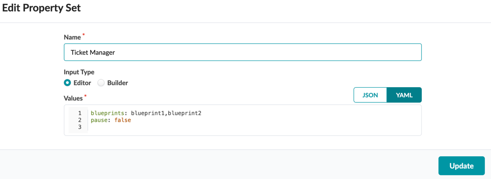

# Snow Tickets
Apstra Anomalies provide an easy way to observe problems in the network fabric.
Service Now is a popular platform to report problems. This automation tracks the fabric and opens tickets in Service Now if there are problems.

## Requirements

- Apstra 4.2.0 or above
- python 3 or above

## Usage

1. Using Docker and Terraform 
- fill out apstra_snow_setup.sh
- copy setup.yaml.template to setup.yaml. Fill in the values as appropriate
- source apstra_snow_setup.sh
- terraform init&&terraform apply
  - This creates the Apstra Property Sets required to manage the app
- docker build . 
- docker run  -v $PWD/setup.yaml:/SnowApp/setup.yaml -e APSTRA_PASS=$APSTRA_PASS -e SNOW_PASS=$SNOW_PASS <docker image name>

2. No Docker and Terraform
- pip3 install -r ./requirements.txt
- copy setup.yaml.template to setup.yaml. Fill in the values as appropriate
- Set up the management property set in Apstra with appropriate values

- 2.4 start the python script 
   % python snow_tickets.py

