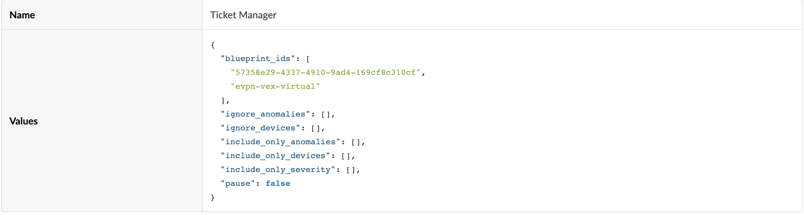

# Snow Tickets
Apstra Anomalies provide an easy way to observe problems in the network fabric.
Service Now is a popular platform to report problems. This automation tracks the fabric and opens tickets in Service Now if there are problems.

## Requirements

- Apstra 4.2.0 or above
- python 3 or above

## Usage
1. pip3 install -r ./requirements.txt
2. copy setup.yaml.template to setup.yaml. Fill in the values as appropriate
3. Set up the management property set in Apstra with appropriate values

4. start the python script 
   % python snow_tickets.py

## ToDo
1. Containerize

